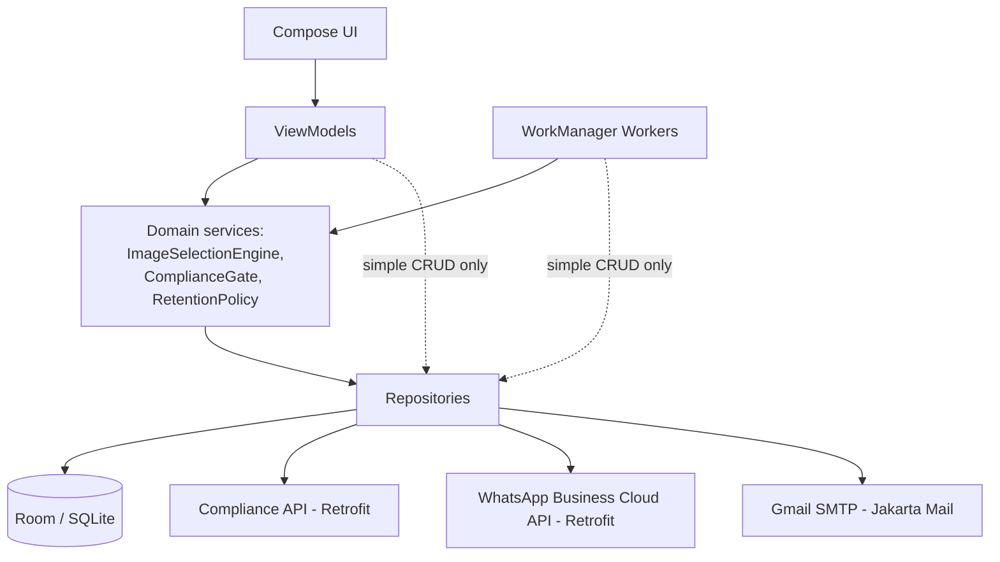
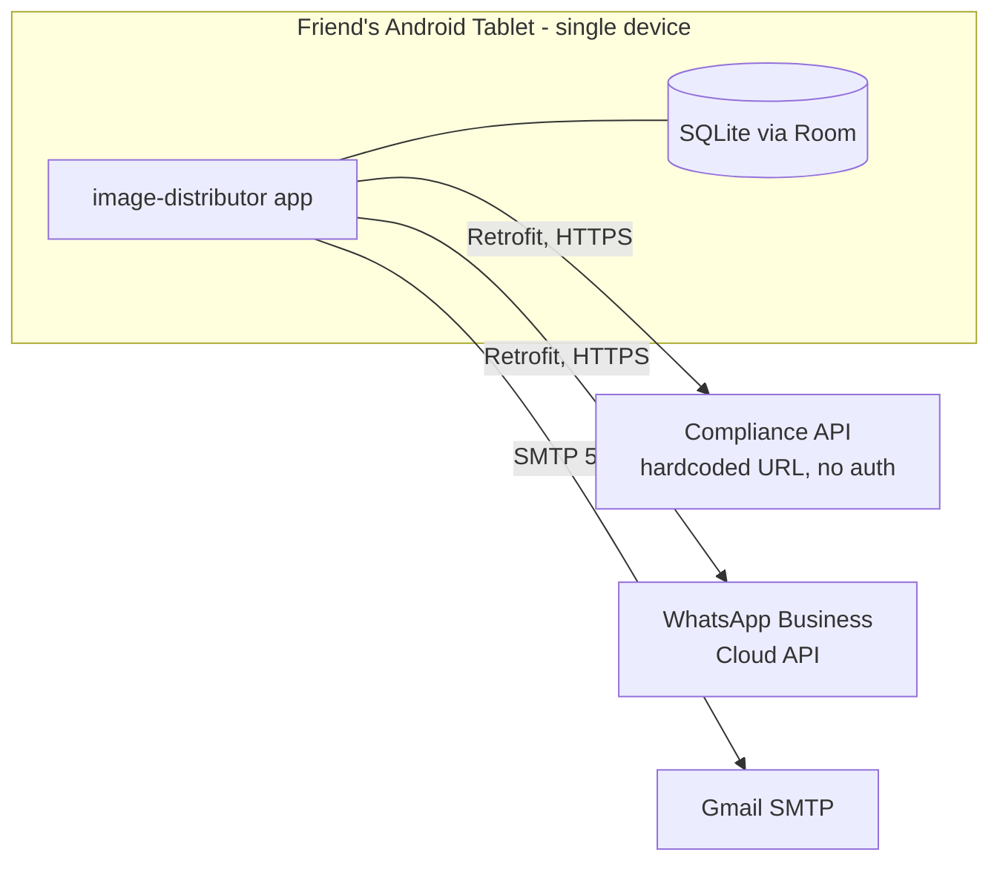
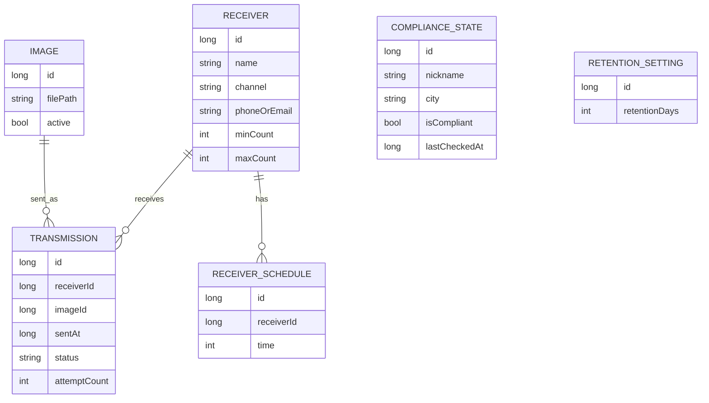

# Architecture Spine — image-distributor-app

## Design Paradigm

Layered MVVM, Google's current official Android App Architecture guidance, with one deliberate deviation: **no backend**. All external effects run directly from the device.

```
ui/        → Compose screens + ViewModels        (presentation)
domain/    → use-cases, ImageSelectionEngine,
             ComplianceGate, RetentionPolicy      (business rules)
data/      → Repositories, Room, Retrofit, SMTP   (data access + external I/O)
worker/    → WorkManager Workers                  (scheduled/background entry points)
```

Data flows up (Room Flow → Repository → ViewModel StateFlow → Compose); actions flow down (Compose → ViewModel → Repository). Workers are a second entry point into the same domain/repository layer — never a parallel path with its own rules.



## Invariants & Rules

### AD-1 — Dependency direction
- **Binds:** all
- **Prevents:** UI or Workers reaching into Room/Retrofit directly, and data-layer code depending back on domain/ui
- **Rule:** Dependencies only point downward per the diagram above (`ui`, `worker` → `domain` → `data`). A layer never imports from a layer above it.

### AD-2 — No backend, single egress point per external API [ADOPTED]
- **Binds:** CAP-4, CAP-6, CAP-7
- **Prevents:** WhatsApp/SMTP/compliance calls scattered across multiple classes with duplicated credentials or divergent request shapes
- **Rule:** Each external system (Compliance API, WhatsApp Business Cloud API, Gmail SMTP) has exactly one Retrofit service or client class in `data/remote/`, used only by its corresponding Repository. No other layer constructs these clients.

### AD-3 — Centralized config, no inline endpoints [ADOPTED]
- **Binds:** CAP-6, CAP-7
- **Prevents:** the hardcoded compliance API URL (or the WhatsApp token, SMTP host) being copy-pasted into more than one file, causing drift on the next change
- **Rule:** All external endpoints and hardcoded values (compliance API URL, WhatsApp Cloud API base URL/token reference, SMTP host) live only in `config/AppConfig.kt`. Nothing else declares them.

### AD-4 — Background execution via WorkManager only [ADOPTED]
- **Binds:** CAP-3, CAP-4, CAP-7, CAP-8
- **Prevents:** a second, competing scheduling mechanism (AlarmManager, foreground service) appearing later and racing WorkManager
- **Rule:** All scheduled/background work (daily sends, retries, compliance re-checks, retention purge) runs through WorkManager Workers. The app requests the "ignore battery optimizations" exemption once, during first-run setup, to keep this reliable — no foreground service, no permanent notification.

### AD-5 — Repository is the only mutation path
- **Binds:** all
- **Prevents:** a ViewModel or Worker writing to Room or calling a Retrofit service directly, bypassing domain rules (selection algorithm, compliance gate, retention policy)
- **Rule:** ViewModels and Workers may call Repository interfaces directly for simple data access (listing/editing images and receivers). For anything owned by a domain service (CAP-3 selection, CAP-7 compliance gating, CAP-8 retention), they call that domain service instead of Repository directly — the domain service receives its required Repositories via constructor injection and calls them internally (not a pure function requiring pre-fetched arguments). In no case does UI or Worker code touch a DAO or remote client directly; only Repositories and domain services do (see AD-2).

### AD-6 — Long autoincrement IDs, no UUIDs [ADOPTED]
- **Binds:** CAP-1, CAP-2, CAP-4, CAP-5
- **Prevents:** unnecessary UUID-merge complexity for a single-device, non-syncing datastore
- **Rule:** All Room primary keys are `Long`, autoincrement. No UUID identifiers.

### AD-7 — Timestamps: epoch-millis in storage, `Instant` at the domain boundary
- **Binds:** CAP-3, CAP-4, CAP-5, CAP-8
- **Prevents:** mixed timestamp representations across entities making date-math (7-day window, 30-day dashboard, retention purge) inconsistent
- **Rule:** Room stores all timestamps as `Long` epoch-millis (UTC). Repositories convert to/from `java.time.Instant` at the domain boundary; domain and UI code never handles raw millis.

### AD-8 — Errors as `AppResult<T>`, not raw exceptions
- **Binds:** all
- **Prevents:** an unhandled exception from a network or DB call surfacing as a crash instead of a handled failure state
- **Rule:** Every Repository method returns `AppResult<T>` (`Success<T>` / `Failure(reason)`), a sealed class in `domain/`. Exceptions are caught at the Repository boundary and translated; they never propagate uncaught into ViewModels or Workers.

### AD-9 — Manual updates, no in-app update path [ADOPTED]
- **Binds:** all
- **Prevents:** half-built auto-update code (version checks, download-and-install flows) accumulating when it was explicitly ruled out
- **Rule:** No code path checks for or installs updates. New versions are rebuilt and resent as an APK; the installer reinstalls manually.

### AD-10 — Business rules live only in `domain/`
- **Binds:** CAP-3, CAP-4, CAP-7, CAP-8
- **Prevents:** the selection algorithm, the compliance fail-open rule, or the retention window being re-implemented (and drifting) in a Worker or ViewModel
- **Rule:** `ImageSelectionEngine` (CAP-3 algorithm, `mechanics.md`), `ComplianceGate` (CAP-7 fail-open rule), and `RetentionPolicy` (CAP-8) are the only places these rules are implemented. Workers and ViewModels call them; they never reimplement the logic inline.

### AD-11 — Compliance caching is asymmetric: never fabricates compliant, may extend a confirmed halt [AMENDED — Story 1.1 code review, 2026-07-09]
- **Binds:** CAP-7
- **Prevents:** `COMPLIANCE_STATE.isCompliant`/`lastCheckedAt` being read to invent a false "compliant" decision (which would silently rebuild the 2-day cache mechanics.md explicitly rejected) — **and** prevents an explicit non-compliant halt from being trivially bypassed by relaunching while offline
- **Rule:** `ComplianceGate` always performs a live API call when the device is online and gates on that live response first (halt only on an explicit non-compliant answer, per CAP-7/mechanics.md). If the live call itself fails/is unreachable, `ComplianceGate` checks `COMPLIANCE_STATE`: if the last *confirmed* live result was explicitly non-compliant, the halt persists (Proceed is not returned just because the device is offline); otherwise it fails open as before. The cache is never read to produce a Proceed that a live check didn't itself justify — it can only extend an already-confirmed Halt, never fabricate a Proceed.

### AD-12 — Single periodic scanning Worker
- **Binds:** CAP-3, CAP-4
- **Prevents:** one WorkManager periodic request per receiver, which multiplies work requests unnecessarily and fights WorkManager's inexact timing/Doze batching
- **Rule:** One periodic `SendWorker` runs on a short fixed interval (e.g. every 15 minutes). Each run checks every receiver's scheduled times (a receiver has one or more, minimum 4 — `ReceiverSchedule` rows) against the current time and dispatches a send for any schedule slot that is due and has not already been sent for that slot today. No per-receiver WorkManager requests exist.

### AD-13 — Transmission: one row per send, updated in place
- **Binds:** CAP-4, CAP-5
- **Prevents:** a retried send inserting a second row, double-counting deliveries on the CAP-5 dashboard
- **Rule:** A `Transmission` row is created once per queued send (status `PENDING`). Retries update that same row's `status`/`attemptCount` in place, up to AD-set retry cap of 3 (mechanics.md). `sentAt` is written only when `status` becomes `SENT`.

### AD-14 — Image files in app-private storage
- **Binds:** CAP-1
- **Prevents:** ambiguity between MediaStore/content-URI access and plain file storage, which would otherwise require deciding storage permissions per implementer
- **Rule:** Uploaded images are copied into app-private internal storage (`context.filesDir/images/`). `Image.filePath` stores a filename relative to that directory, never an absolute path or `content://` URI. No storage permission is requested.

### AD-15 — Schema migrations required once real data exists
- **Binds:** all (data layer)
- **Prevents:** a future update destructively wiping the friend's 30-day transmission history or the permanently-locked CAP-6 registration fields
- **Rule:** After v1 is installed on the friend's tablet, every Room schema change ships an explicit `Migration`. `fallbackToDestructiveMigration()` is never used in a build meant to install over an existing install with real data.

## Consistency Conventions

| Concern | Convention |
| --- | --- |
| Naming (entities, files, interfaces, events) | Entities: `Image`, `Receiver`, `ReceiverSchedule`, `Transmission`, `ComplianceState`, `RetentionSetting` (PascalCase singular). DAOs: `<Entity>Dao`. Repository interfaces: `<Area>Repository`; impls: `<Area>RepositoryImpl`. Workers: `<Purpose>Worker` (e.g. `SendWorker`, `RetentionPurgeWorker`, `ComplianceCheckWorker`). ViewModels: `<Screen>ViewModel`. Compose screens: `<Screen>Screen`. |
| Data & formats (ids, dates, error shapes, envelopes) | IDs: `Long` autoincrement (AD-6). Dates: epoch-millis in DB, `Instant` in domain (AD-7). Enums stored as `String` names: `channel` = `WHATSAPP`\|`EMAIL`; `status` = `PENDING`\|`SENT`\|`FAILED`. Errors: `AppResult<T>` sealed class (AD-8). `ReceiverSchedule.time`: `Int` minutes-since-midnight, device local time — a receiver has one or more (`receiverId` FK, minimum 4 enforced at save time, not schema-level). `RetentionSetting` and `COMPLIANCE_STATE` are singleton tables: exactly one row, seeded at DB creation with `id = 1`, always read/written at that fixed id — no other insert path exists. |
| State & cross-cutting (mutation, errors, logging, config, auth) | Unidirectional data flow: Room `Flow` → Repository → ViewModel `StateFlow` → Compose `collectAsStateWithLifecycle()`. Mutation only via Repository (AD-5). Logging via one `Logger` wrapper, tagged per module (`"ImgDist:<Component>"`). Config centralized in `config/AppConfig.kt` (AD-3). Auth: none on compliance/registration APIs (per spec); WhatsApp Cloud API token also lives only in `AppConfig`. |

## Stack

| Name | Version |
| --- | --- |
| Kotlin | 2.4.0 |
| Jetpack Compose (BOM) | 2026.06.01 |
| Android Gradle Plugin | 9.2.0 |
| Room | 2.8.x stable line (Room 3.0 KMP/coroutines-only is alpha as of authoring — deferred, see Deferred) |
| WorkManager | 2.10.x (pin exact patch against `androidx.work` release notes at build time — 2.11.2 could not be confirmed against a primary source) |
| Retrofit | 3.0.0, using its bundled default OkHttp (4.12) — do not force-override to a newer OkHttp without a specific need |
| Jakarta Mail (Gmail SMTP) | latest stable at build time; auth via Gmail App Password (see Deferred for OAuth2 migration) |
| DI | manual (`AppContainer`), no framework |

## Structural Seed



**Deployment & environments:** one deployment target — the friend's tablet — no dev/staging/prod split and no backend to environment-configure. The only "environment" variables are the three external endpoints, fixed in `config/AppConfig.kt` at build time. Distribution and updates are both manual APK transfer over WhatsApp (AD-9); no CI/CD pipeline exists or is planned.

```text
app/src/main/java/com/ris/imagedistributor/
  ui/            # Compose screens + ViewModels: setup, images, receivers, dashboard, compliance
  domain/        # ImageSelectionEngine, ComplianceGate, RetentionPolicy, AppResult, domain models
  data/
    local/       # Room entities, DAOs, AppDatabase
    remote/      # ComplianceApi, WhatsAppApi (Retrofit), SmtpClient (Jakarta Mail)
    repository/  # Repository interfaces + impls bridging domain <-> data
  worker/        # SendWorker, ComplianceCheckWorker, RetentionPurgeWorker
  di/            # AppContainer (manual DI)
  config/        # AppConfig.kt (all hardcoded endpoints/constants)
```



## Capability → Architecture Map

| Capability / Area | Lives in | Governed by |
| --- | --- | --- |
| CAP-1 Image library | `data/local` (Image entity, ImageDao), `ui/images` | AD-5, AD-6, AD-14 (app-private file storage) |
| CAP-2 Receiver configuration | `data/local` (Receiver entity), `ui/receivers` | AD-5, AD-6 |
| CAP-3 Randomized selection | `domain/ImageSelectionEngine` | AD-10, AD-12 (scanning worker), `mechanics.md` |
| CAP-4 Offline-safe queue | `worker/SendWorker`, `data/repository` | AD-4, AD-5, AD-8, AD-12, AD-13, `mechanics.md` (3-retry cap, no-backfill-of-missed-days rule, queued-but-later-inactive still sends) |
| CAP-5 Dashboard / proof of delivery | `ui/dashboard`, `data/local` (Transmission) | AD-6, AD-7, AD-13 |
| CAP-6 First-run registration | `ui/setup`, `data/remote` (registration call) | AD-2, AD-3, `mechanics.md` (name/city locked permanently, no edit path) |
| CAP-7 Compliance/licensing gate | `domain/ComplianceGate`, `worker/ComplianceCheckWorker` | AD-2, AD-3, AD-10, AD-11 |
| CAP-8 Retention/purge | `domain/RetentionPolicy`, `worker/RetentionPurgeWorker` | AD-10; default retention 30 days (`mechanics.md`), operator-configurable |

## Deferred

- **App signing/keystore management** — an operational detail for whoever builds the release APK, not an architectural invariant. No signing scheme is bound here.
- **Automated test framework specifics** — standard AndroidX Test + JUnit is a reasonable default at implementation time; not bound as a decision since it wasn't elicited and doesn't risk divergence for a single-developer build.
- **WhatsApp Business Cloud API message template content/approval** — external dependency, account setup already in progress; template specifics land once the account is provisioned.
- **Analytics/crash reporting** — not requested; no tooling bound. Add later if needed without touching this spine's invariants.
- **Multi-operator/multi-tenant support** — explicitly out of scope (spec non-goal); this spine assumes exactly one operator per installed app.
- **Room 3.0 (KMP/coroutines-only)** — alpha as of authoring; stay on the 2.8.x stable line until it reaches stable and there's a reason to move.
- **Gmail SMTP auth beyond App Password** — App Password is the v1 default (simple, works today). If Google further restricts app passwords, migrate to OAuth2/XOAUTH2 — not needed until then.
